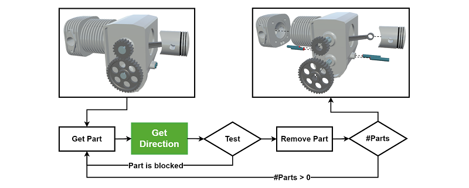

# AssemblyNet: A Point Cloud Dataset and Benchmark for Predicting Part Directions in an Exploded Layout

Official PyTorch implementation of "AssemblyNet: A Point Cloud Dataset and Benchmark for Predicting Part Directions in an Exploded Layout," accepted at WACV 2024.

AssemblyNet is a novel point cloud dataset for the prediction of part directions used in the automatic generation of exploded view animations. We benchmarked the dataset on four well-known point cloud based methods as well as two novel methods using a two-path approach with two different backbones.

For further information, please contact [Jesper Gaarsdal](mailto:gaarsdal.jesper@gmail.com).

## Abstract
Exploded views are powerful tools for visualizing the assembly and disassembly of complex objects, widely used in technical illustrations, assembly instructions, and product presentations. Previous methods for automating the creation of exploded views are either slow and computationally costly or compromise on accuracy. Therefore, the construction of exploded views is typically a manual process. In this paper, we propose a novel approach for automatically predicting the direction of parts in an exploded view using deep learning. To achieve this, we introduce a new dataset, AssemblyNet, which contains point cloud data sampled from 3D models of real-world assemblies, including water pumps, mixed industrial assemblies, and LEGO models. 
The AssemblyNet dataset includes a total of 44 assemblies, separated into 495 subassemblies with a total of 5420 parts. We provide ground truth labels for regression and classification, representing the directions in which the parts are moved in the exploded views. We also provide performance benchmarks using various state-of-the-art models for shape classification on point clouds and propose a novel two-path network architecture.

## Dataset

The AssemblyNet dataset contains both 512-point and 1024-point point clouds of mixed industrial assemblies and LEGO models.
It includes annotations for both classification and regression of 5420 samples. Each sample consists of two point clouds in separate files, one of the specific part and one of its subassembly.
The classification uses 26 categories representing 26 world space directions, while regression uses the world space direction as X, Y, and Z values.

The dataset is published on Zenodo: [https://doi.org/10.5281/zenodo.10069220](https://doi.org/10.5281/zenodo.10069220)

### Benchmarked Model Architectures

The four state-of-the-art models used in our benchmarks are:

* [DGCNN](https://liuziwei7.github.io/projects/DGCNN)
* [PointNet](https://stanford.edu/~rqi/pointnet/)
* [PointNet++](https://stanford.edu/~rqi/pointnet2/)
* [SimpleView](https://github.com/princeton-vl/SimpleView)

We also designed and tested a novel two-path approach, using either DGCNN or PointNet++ as the backbone:

* [2P-DGCNN](./models/2p-dgcnn.py)
* [2P-PointNet2](./models/2p-pointnet2.py)

## Requirements

Requirements can be found in the [requirements.txt file](./requirements.txt).

## Citation
If you find this dataset and our work useful for your research, please consider citing the paper:

	@InProceedings{Gaarsdal2024AssemblyNet,
	  title={AssemblyNet: A Point Cloud Dataset and Benchmark for Predicting Part Directions in an Exploded Layout},
	  author={Gaarsdal, Jesper and Haurum, Joakim Bruslund and Wolff, Sune and Madsen, Claus Brøndgaard},
	  booktitle={Proceedings of the IEEE/CVF Winter Conference on Applications of Computer Vision (WACV)},
	  month={January},
      year={2024}
	}

## License
[MIT License](./LICENSE).